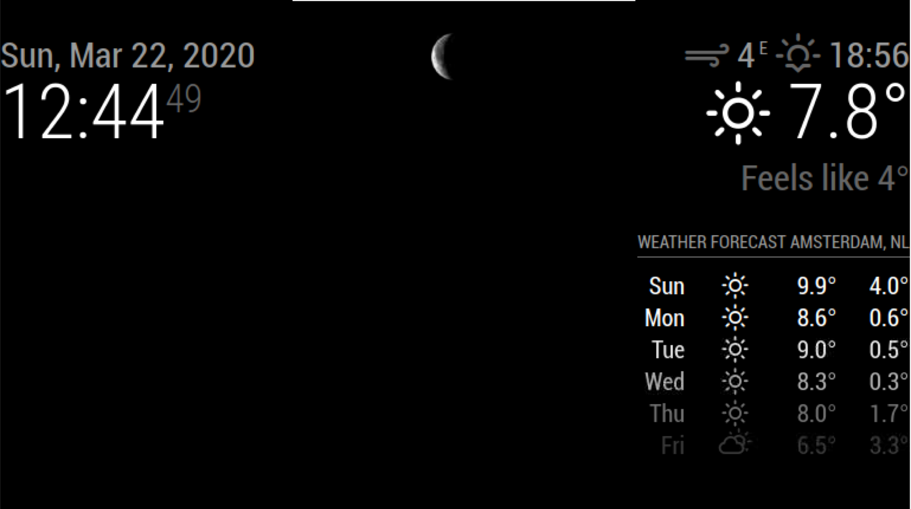

# Magic Mirror Module: mmm-moon-phase-display
This [MagicMirror2](https://github.com/MichMich/MagicMirror) module allows you to fetch an image of the moon in its current phase

## Installation

In your terminal, go to your MagicMirror's Module folder:
````
cd ~/MagicMirror/modules
git clone https://github.com/Sven1603/mmm-moon-phase-display.git
````

Configure the module in your `config.js` file.

## Using the module

There isn't much to configure really, you just need to position it and optionally set a suitable size for you via the config options.

Now add the module to the modules array in the `config/config.js` file:

````javascript
modules: [
        {
                module: 'mmm-moon-phase-display',
                position: 'top_center',        // this can be any of the regions
                config: {
                }
        },
]
````

## Config Options
| **Option** | **Default** | **Description** |
| --- | --- | --- |
| `height` | 40 | The height of the image. |
| `width` | 40 | The width of the image. |

## Screenshot
